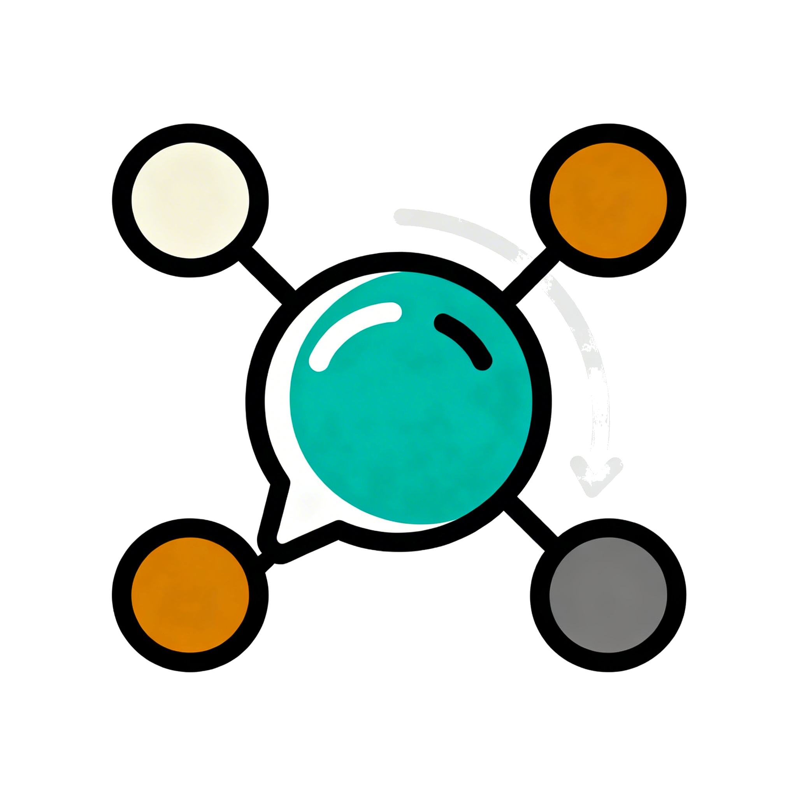
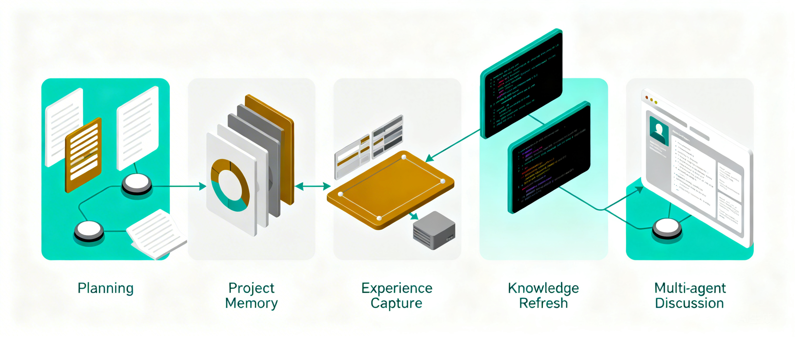

[English](README.md) | 简体中文

<table>
  <tr>
    <td valign="middle">
      <h1>vibe-coding-skills</h1>
      <p>面向 vibe coding 工作流的可复用、偏生产化的 skills 仓库。</p>
    </td>
    <td align="right" valign="middle" width="220">
      
    </td>
  </tr>
</table>

本仓库聚焦于能够稳定提升 AI coding 产出的高价值技能：
- 规划与生命周期治理
- 项目记忆连续性
- 可复用经验沉淀
- 外部知识校验
- 多智能体讨论引导

## 仓库提供什么

- 以 `SKILL.md` 为核心的仓库契约（`skills/<slug>/SKILL.md` 为必需项）。
- 位于 `.devtools/` 下的确定性校验与发布工具。
- 面向 `codex`、`claude`、`cursor`、`gemini`、`copilot` 的跨工具分发配置。
- 一个持续扩展的、覆盖真实 vibe coding 场景的 skill 库。

## 当前 Skills（v1）



| Skill | 核心价值 | 典型产出 | 关键特性 |
| --- | --- | --- | --- |
| `sdd-plan-maintainer` | 让复杂编码任务变得可执行、可治理 | 具体计划 + 生命周期状态更新 | 模块拆解、里程碑跟踪、完成门禁、计划归档与索引同步 |
| `layered-project-memory` | 保持中断会话后的项目连续性 | 分层记忆记录 + 聚焦上下文包 | L1/L2/L3 记忆模型、Git 锚点、指针优先证据、基于记录派生 summary |
| `experience-capture` | 将高价值对齐与难题解决过程沉淀为可复用经验 | 经验卡片 | 决策规则、反模式、review checklist，与项目记忆严格分界 |
| `knowledge-refresh` | 用外部证据降低过时知识带来的错误判断 | 基于证据的结论（`confirmed/revised/inconclusive`） | 来源优先级、时效性感知校验、权威来源优先工作流 |
| `multi-agent-discussion-advisor` | 在执行前提升复杂讨论质量 | discussion advisory card + 子 agent 启动说明 | 最小充分角色设计、面向宿主 coding agent 的 launch specification、仅 advisory 不做业务编排 |

## 仓库契约

每个 skill 都位于 `skills/<skill-slug>/`。

必需项：
- `SKILL.md`

可选项（按需推荐）：
- `references/`
- `scripts/`
- `agents/`（例如 `openai.yaml` 这类工具/平台适配文件）
- `assets/`

一旦发布，`skill-slug` 应尽量保持稳定，因为运行时安装目录通常直接映射这个名字。

示例（单个 skill 的标准结构）：

```text
skills/example-skill/
  SKILL.md
  references/
  scripts/
  agents/
  assets/
```

## 前置依赖

必需：
- `bash`
- `python3`
- `rsync`

Python 包：
- `PyYAML`（用于 smoke 时校验 frontmatter）

推荐使用 `uv` 管理 Python 环境：

```bash
uv venv
source .venv/bin/activate
uv pip install pyyaml
```

不使用 `uv` 时的 fallback：

```bash
python3 -m pip install pyyaml
```

## 校验

仓库结构检查：

```bash
./.devtools/check-structure.sh
```

校验单个 skill：

```bash
./.devtools/smoke.sh --skill-dir skills/sdd-plan-maintainer
```

Smoke 设计：
- `.devtools/smoke.sh` 只是调度层。
- 每个 skill 自己维护 `skills/<skill>/scripts/smoke.sh`（或 `smoke.py`）实现。

## 发布

默认行为：
- `release.sh` 和 `release-all.sh` 默认发布到 `user-level` 的 skill 目录，除非显式传入运行时目标路径。

发布单个 skill：

```bash
./.devtools/release.sh --tool codex   --skill-dir skills/sdd-plan-maintainer
./.devtools/release.sh --tool claude  --skill-dir skills/sdd-plan-maintainer
./.devtools/release.sh --tool cursor  --skill-dir skills/sdd-plan-maintainer
./.devtools/release.sh --tool gemini  --skill-dir skills/sdd-plan-maintainer
./.devtools/release.sh --tool copilot --skill-dir skills/sdd-plan-maintainer
```

发布全部 skills：

```bash
./.devtools/release-all.sh --tool codex
./.devtools/release-all.sh --tool claude
./.devtools/release-all.sh --tool cursor
./.devtools/release-all.sh --tool gemini
./.devtools/release-all.sh --tool copilot
```

通过显式覆盖运行时路径发布到 `project-level`：

```bash
./.devtools/release.sh --tool copilot --skill-dir skills/experience-capture --runtime-root /path/to/project/.github/skills/experience-capture
./.devtools/release.sh --tool cursor  --skill-dir skills/experience-capture --runtime-root /path/to/project/.cursor/skills/experience-capture
```

所有发布操作都采用白名单分发：
- `SKILL.md`
- `agents/**`（如果存在）
- `references/**`（如果存在）
- `scripts/**`（如果存在）
- `assets/**`（如果存在）

这样可以保证运行时 skill 目录干净，不会混入仓库内部文件。

## 兼容性基线

- 核心契约是 `SKILL-first`（`SKILL.md` 是唯一必需的事实源）。
- 平台适配文件放在 `agents/` 下，且是可选的。
- 更细的 profile 路径与约束见 `docs/compatibility/skills-matrix.md`。

## 已验证平台

已经过实际验证：
- `Codex`
- `Claude Code`
- `Gemini CLI`
- `GitHub Copilot`
- `Cursor`

已验证的安装 / 加载路径：
- `Codex`：个人级运行时发布到 `~/.codex/skills/<skill>`
- `Claude Code`：个人级运行时发布到 `~/.claude/skills/<skill>`
- `Gemini CLI`：个人级运行时发布到 `~/.gemini/skills/<skill>`
- `GitHub Copilot`：项目级 `.github/skills/<skill>`，以及个人级 `~/.copilot/skills/<skill>`
- `Cursor`：项目级 `.cursor/skills/<skill>`、项目级 `.agents/skills/<skill>`，以及个人级 `~/.cursor/skills/<skill>`

实践说明：
- 本仓库围绕 `SKILL-first`、工具无关的契约构建。
- 即使某个平台的发现路径不同，可复用的源资产仍然是 `skills/<skill>/SKILL.md`，以及可选的 `references/`、`scripts/`、`agents/`、`assets/`。

## 里程碑与 Roadmap

当前里程碑：
- v1 已完成，包含 5 个核心 vibe coding 场景 skills。

下一阶段扩展方向：
- 长时运行类 skill：支持可恢复执行、checkpoint/handoff 纪律，以及多会话编码中的低损耗上下文连续性。
- CI 相关 skill：支持测试策略选择、发布门禁检查、回归问题分诊，以及更适合 CI 的质量工作流。
- 发布 / 安装策略细化：进一步明确 `project-level` 与 `user-level` 的发布支持，并按平台补全安装指引。

Roadmap 原则：
- 新增 skill 仍然应保持 guidance-first（先验知识 + 工作流模式 + 可复用脚本），而不是演化成业务 runtime orchestration 模块。
